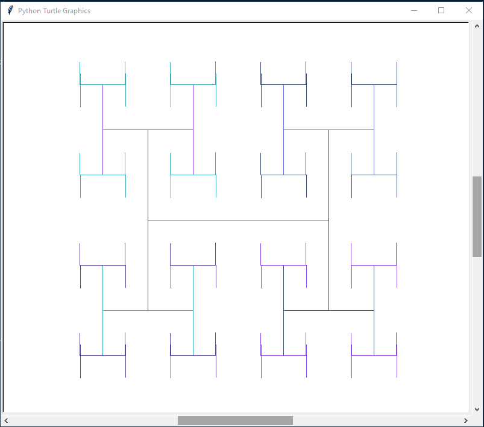

# Python-random-Algorithms
Random python algorithms made by me at some point in my learning process

# 1.Método Símbólico
Programa en Python que a través de un menú, permita seleccionar cualquiera de estas opciones y dado un valor de n, mostrar cuantas y cuáles cadenas binarias de longitud n cumplen con la condición pedida. El programa no puede generar todas las cadenas binarias de longitud n y de estas, eliminar las que no cumplan.

1. Cadenas binarias que no contengan a las subcadenas 00 y 01.
2. Cadenas binarias que no contengan a las subcadenas 00 y 11.
3. Cadenas ternarias que no contengan a la subcadena 00.
4. Cadenas cuaternarias que tengan sus caracteres en orden estrictamente creciente.
5. Cadenas ternarias que no tienen la subcadena 22.
6. Cadenas binarias que no contengan la subcadena 000.
7. Cadenas binarias que no contengan a la subcadena 000 ni a la subcadena 010.
8. Cadenas ternarias que no contengan a la subcadena 000.

# 2.Fractales
Programa en Python que reciba un valor n y cree el fractal de tamaño, escogido por medio de un menu.

# 3.Triángulo Capaz Alternas - Función recursiva 2D
Disene e implemente arreglos recursivos 2D, utilizando la siguente metodología:
1. Un if para el caso base.
2. Un elif por cada singularidad.
3. Un else para los llamados recursivos mas pequeños, internamente se repite el proceso anterior, dependiendo del numero.
